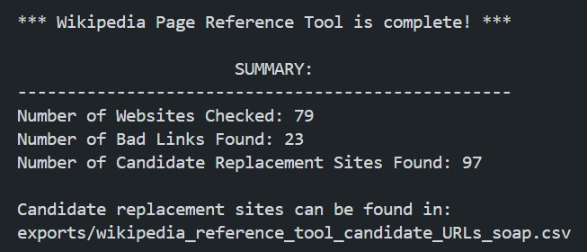

# Wikipedia Reference Tool

## Requirements

This program was built using [Python 3.11](https://www.python.org/downloads/release/python-3110/). If you encounter any issues running the program, it is recommended to use this version to ensure compatibility.

You will also need all the libraries from the following command:

```bash
pip install requests beautifulsoup4 pandas chardet nltk sumy pyspellchecker spacy scikit-learn levenshtein scipy
```

Finally, you will need the following:

- [Custom Search JSON API](https://developers.google.com/custom-search/v1/overview): A unique identifier used to authenticate and authorize requests to an API.
- [Custom Search Engine Identifier](https://programmablesearchengine.google.com/controlpanel/all) A unique code that specifies the configuration and scope of a Google Custom Search Engine.

Both the API Key and CSE ID are free and quick to obtain. For Google's free Custom Search plan, a user is granted **100** searches a day, with **10** results maximum per result. From all the test runs, it seems like ~*10-40*% of all links have undesirable HTTP status codes, so keep this in mind when wanting to fix a Wikipedia page with a lot of references.

## How to run program

Once you have everything required, run the program by entering the following command in the directory:

```bash
python .\main.py
```

You will then be prompted to:
1. Enter your email (for [User Agent](https://developer.mozilla.org/en-US/docs/Glossary/User_agent))
2. Enter your [Search API](https://developers.google.com/custom-search/v1/overview) 
3. Enter your [CSE ID](https://programmablesearchengine.google.com/controlpanel/all)
4. Enter the name of the page you would like to fix

The program will search Wikipedia to see if the article exists and grab the data from the reference section. After, it will begin checking the HTTP status codes for each reference URL. Below is an example output of getting to this point:


Once all the reference URLs have been checked, the program will begin searching for candidate replacement links per site: 


After the program has searched for all candidate links, the summary will appear at the end:



In the `exports` folder, a CSV file with the name: 
`wikipedia_reference_tool_candidate_URLs_` + **`ARTICLE_NAME`** will populate. The file looks like:


The dataframe from the file has the following attributes:

| Attribute | Description |
|----------|----------|
| `reference_number`    | The reference number that has a broken link |
| `reference`    | The text description of the reference   |
| `URL`    | The broken link from the reference   |
| `status`    | The HTTP status code returned from the URL   |
| `description`    | The text description of the HTTP status code   |
| `candidate_replacement_url`    | A potential replacement URL  |
| `cosine_similarity`    | The Cosine Similarity between the archive text/reference description and the text of the candidate site   |
| `jaccard_index`   | The Jaccard Index between the archive text/reference description and the text of the candidate site   |
| `levenshtein_distance`    | The Levenshtein Distance between the archive text/reference description and the text of the candidate site   |
| `euclidean_distance`   | The Euclidean Distance between the archive text/reference description and the text of the candidate site  |

If you are running the program multiple times, it may be better to make changes in `main.py`. This way, you will not have to input your email, API Key, and CSE ID every time:


For a demonstration of how to prepare the environment and run the program, you can watch the [YouTube video](https://www.youtube.com/watch?v=gQcfLhRnTQE) that corresponds to this README file.

<!-- ## Examples

In the `exports` folder, you'll be able to find some previous CSV files from testing the tool. 

In addition, there's an explanation and demonstration of the tool here → LINK YOUTUBE VIDEO. -->
